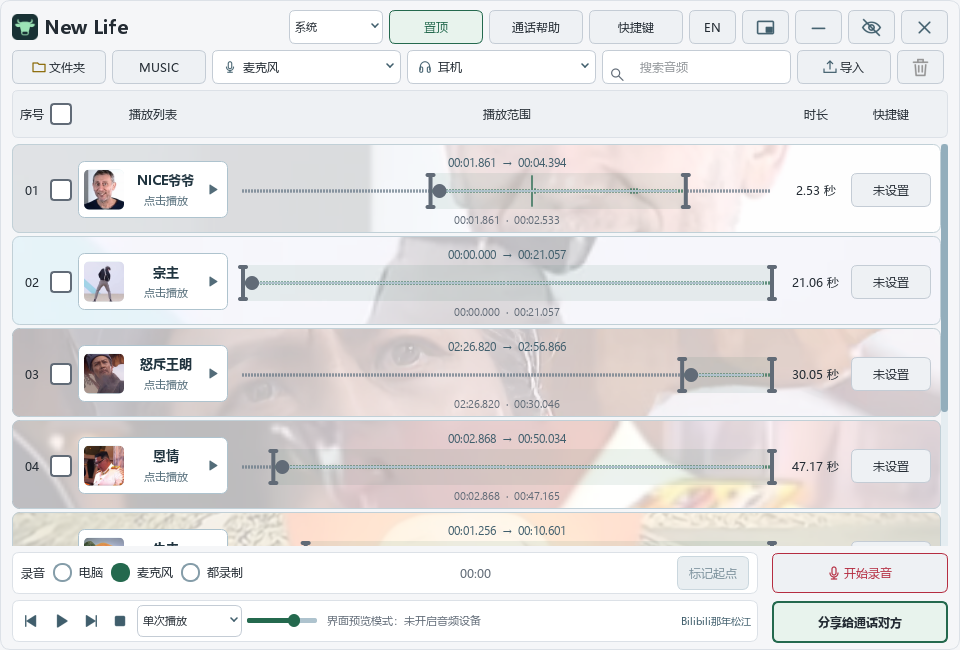

# New Life

免费的 Windows 11 x64 文件夹音效播放器、录音与通话混音工具，支持中文和英文。点击头像和名称播放，再点停止；波形拖动编辑至少 1 秒的范围。支持电脑／麦克风／混合录音、全局快捷键、380×48 单行迷你条和 VB-CABLE 通话混音。

[下载 Windows 运行包](https://github.com/whathappenaaa/NewLife/releases/latest) · [使用说明](docs/使用说明.txt) · [开发流程与练习](docs/开发流程与练习.md) · [GitHub 上传与更新教程](docs/GitHub上传与更新教程.md)

本项目源码以 [MIT 许可证](LICENSE) 开源，作者署名 **Bilibili那年松江**。播放器可免费下载和使用，第三方组件保留各自许可证，详情见文末。



## 直接运行

打开 [Releases 下载页面](https://github.com/whathappenaaa/NewLife/releases)，在对应版本的 **Assets** 中下载 `NewLife-v0.6.2-win-x64.zip`。完整解压后，双击文件夹中的 `NewLife.exe`；保留旁边的 `_internal`、`vendor`、`MUSIC` 和许可证文件。无需安装 Python 或 FFmpeg。包内附六份音频及对应的头像、背景和播放范围配置，首次启动即可使用。

GitHub 的 **Code → Download ZIP** 和 Releases 自动生成的 **Source code** 是源码，供开发者使用；想直接运行软件，请下载上面的 Windows 运行包。

首次默认使用程序旁的 `MUSIC`；已有自选文件夹继续保留。列表只包含当前文件夹直接下的媒体。音频支持 WAV、MP3、FLAC、OGG、Opus、M4A、M4B、AAC、WMA、AIFF、APE；视频支持 MP4、MKV、MOV、WebM、AVI、WMV、FLV、TS、MTS、M2TS、M4V、VOB、MPEG、3GP。识别以实际音轨为准，视频只播放声音。录音、导入和另存也保存在这里。

把媒体文件拖入列表即可复制导入；同名自动加序号。导入结束显示成功、跳过、失败数量，详情可查看每个文件的实际结果。序号右侧的复选框用于批量删除；最近一批删除后30秒内可撤销，继续删除会替换上一批撤销机会；到期或退出时移入系统回收站。回收失败时保留暂存文件及恢复记录，不永久删除。

回收站中保存的是包含整批音频与配置的恢复文件夹。需要恢复时，在系统回收站还原该文件夹，然后重新打开New Life并点击撤销，软件会恢复原文件名及配置。异常退出或回收失败留下的历史记录在普通退出时继续保留，等待处理。

播放范围中央是一条进度轴：绿色为已播放，灰色为未播放；单个圆点表示当前位置，始终位于播放范围内。拖动圆点定位只作用于当前声音，左右边界用于至少一秒的范围编辑，时间数值可打开精确编辑。头像／名称才触发播放，拖动波形不会误播。图片拖到头像或背景会打开对应裁剪窗口；右键可分别恢复默认头像、背景或完整播放范围。

修改过的媒体旁会保存 `文件名.ext.newlife` 配置包，内含范围、原图、裁剪、外观、音轨选择及快捷键。复制媒体和这个包到另一台电脑即可恢复；拖入媒体时也会自动携带旁边的包。设备、列表排序、语言、缓存与日志保存在本机 `%LOCALAPPDATA%/NiuLaiPlayerPython`；升级前自动备份数据库。

默认跟随 Windows 音频设备。主窗口上方直接选择麦克风和耳机／扬声器，可以更改系统默认设备，也可打开 Windows 声音设置；修改会影响其他软件，退出后保留。录电脑声音跟随当前输出，虚拟通话设备自动检测。系统若选了虚拟线，保留真实设备防止回路并提示。新接入设备在录音／通话期间无法识别时会提示结束后刷新。

顶部精简为两排，设备、文件夹、搜索与导入按固定比例排列；序号、勾选框、播放按钮及表头对齐。文件夹区只显示名称，点击可打开目录。顶部直接选择深色、浅色或跟随系统，以及迷你置顶。通话帮助和快捷键打开独立面板，再点同一个入口即可关闭；切换入口只显示一类，快捷键草稿保留，保存后生效。图标按钮悬停显示说明。迷你条可按住头像、名称或空白处拖动，拖动不会触发播放。

底部录音和分享按钮使用相同列宽，状态和署名并入底部控制区。录音时显示红点、来源和累计时间，来源锁定；点“结束并保存”完成保存，新录音在列表中高亮，点击后才播放。右下角分享按钮与“未连接／仅麦克风／麦克风＋片段”状态帮助区分片段分享和整条通话连接。

主窗口和迷你条均有两个独立按钮：**隐藏到托盘**保留录音、通话、快捷键；**× 退出**保存录音并结束程序。右上角 `中文／EN` 切换语言，右键音频可上传头像或重新调整裁剪区域。

## 在 VS Code 中开发

安装 Git、Python 3.13 x64、VS Code，以及 VS Code 的 Python 和 Python Debugger 扩展。新电脑从克隆项目开始：

```powershell
git clone https://github.com/whathappenaaa/NewLife.git
cd NewLife
.\setup.ps1
.\run.ps1
```

`setup.ps1` 创建独立环境、安装锁定依赖并下载校验 FFmpeg 解码组件。已有这个项目文件夹时，从运行 `setup.ps1` 开始，无需再次克隆。也可逐步执行：

```powershell
py -3.13 -m venv .venv
.\.venv\Scripts\python.exe -m pip install -r requirements-lock.txt
.\.venv\Scripts\python.exe -m pip install -e . --no-deps
.\.venv\Scripts\python.exe scripts/fetch_ffmpeg.py
.\.venv\Scripts\python.exe -m niulai_player
```

1. 在 VS Code 打开 `New Life.code-workspace`，选择解释器 `.venv/Scripts/python.exe`。
2. 按 F5，选择“New Life：启动与调试”。
3. 想练习时使用“New Life：示例音频（独立测试数据）”，配置与正式数据隔离。
4. 在 `src/niulai_player/controller.py` 的 `trigger()` 内设置断点，点击头像，用 F10 单步观察播放／停止的判断。

| 模块 | 作用 |
|---|---|
| `app.py`、`controller.py` | 启动、日志、单实例与统一操作入口 |
| `ui.py`、`widgets.py`、`avatar_crop.py`、`i18n.py` | 窗口、波形、裁剪与即时语言切换 |
| `library.py`、`portable.py`、`file_undo.py` | 文件扫描、配对导入／删除与撤销、便携配置与本机索引 |
| `media_decode.py`、`vendor/ffmpeg/` | 实际格式检测、多音轨、渐进解码与缓存 |
| `audio.py`、`audio_processing.py` | 采集、播放、录音、独立输出缓冲及峰值保护 |
| `windows_audio.py`、`system_settings.py` | Windows默认设备同步与永久保存 |
| `branding.py`、`assets/`、`music_folder.py` | 共用图标与程序旁 MUSIC 的路径解析 |
| `hotkeys.py`、`tests/` | 后台快捷键与隔离测试 |

学习步骤见 [开发流程与练习](docs/开发流程与练习.md)，验证结果见 [验收记录](VALIDATION.md)。内部 Python 包名保留 `niulai_player`，避免破坏已有环境。

## 给通话对方播放

1. 从 [VB-Audio 官网](https://vb-audio.com/Cable/) 了解并安装 VB-CABLE 驱动，再重启。驱动由第三方独立提供，使用与分发须遵守其条款；本项目不捆绑驱动，也不静默安装。
2. 在顶部确认真实麦克风和本地耳机；标准 `CABLE Input (VB-Audio Virtual Cable)` 自动检测。
3. 开启“分享片段到通话”。微信／QQ／Discord 或游戏的输入设备选择对应的 `CABLE Output`。
4. “通话帮助”按三个步骤引导：检查虚拟设备，在微信／QQ／Discord或游戏中选择对应的 `CABLE Output`，连接后发送测试声音。播放器中的连接按钮建立混音链路；通话软件内部的输入选择仍需在那里操作。
5. 让对方确认是否听到测试声音。发送电平表示播放器向虚拟线送出声音，不能证明对方已经收到。

停止片段或关闭分享开关都保留本人讲话；完全断开通话在通话帮助中操作。状态区明确显示未连接、仅麦克风或麦克风＋片段。系统录音流不返回通话，本人的麦克风默认不在耳机监听。

根据最新选择，Windows设备修改永久保留，不在断开、退出或下次启动时恢复。旧恢复记录归档保留；不再自动回退。软件仍不修改音频增强、系统音量或“侦听此设备”。

听到自己的声音时，在 Windows 麦克风属性检查“侦听此设备”，并检查声卡软件的侧音／监听；使用耳机。录音断续可查看顶部“通话帮助”中的缓冲和丢帧诊断。音频增强的影响需在实际设备上比较，软件不会自动开关它。

## 测试与发布

```powershell
.\.venv\Scripts\python.exe -m pytest -q
.\build.ps1
.\.venv\Scripts\python.exe tools/verify_release.py artifacts/release-v0.6.2/NewLife/NewLife.exe
```

`--no-audio` 为界面预览；截图验证不会修改系统通信设置。设备同步和永久保存测试使用模拟设备，不修改真实默认麦克风。v0.6.2 已通过 360 项自动化测试和 16 项打包运行检查，六套自带音频的便携配置在全新启动中恢复成功；这些检查不能代替真实通话验证。真实麦克风质量、长时间混合录音，以及微信／QQ／Discord 双方是否同时听到讲话和片段，需要使用真实设备配合验证。详情见 [验收记录](VALIDATION.md)。

主窗口底部署名：**Bilibili那年松江**。

## 准备自带音频

开发时把拥有分发权限的音频与对应 `.newlife` 配置放在项目根目录 `MUSIC`，然后运行打包脚本。发布版会复制到 EXE 旁的 MUSIC；不包含其他播放文件夹、录音恢复文件或本机数据库。

当前 MUSIC 内附 **恩情、老头笑、牛来、怒斥王朗、宗主、NICE爷爷** 六份音频，每份都保留同名 `.newlife` 包里的头像、背景及播放范围。复制或移动时，请带上配对的两个文件。已有有效自选文件夹的用户，通过文件夹按钮选择程序旁的 MUSIC 即可看到这些音频。`examples/audio` 另有四份由程序生成的开发样例。

已有播放器、只想添加这些音频时，可在 [Releases](https://github.com/whathappenaaa/NewLife/releases/latest) 下载 `NewLife-MUSIC-v0.6.2.zip`，解压到一个新文件夹，再在播放器中选择其中的 MUSIC。资源包不含 EXE。[音频及配置验证记录](docs/bundled-music-v0.6.2.json)

## 开源与第三方组件

本项目自行编写的源码与项目资源采用 [MIT](LICENSE)：允许使用、修改和再分发，保留许可证及版权说明。MIT 也允许商业使用；本项目发布的 New Life 运行包免费提供。[MIT 许可证说明](https://choosealicense.com/licenses/mit/)

Python、PySide6／Qt、PyAudioWPatch／PortAudio、NumPy、soundfile／libsndfile、soxr／libsoxr、Send2Trash、PyInstaller 和 FFmpeg 各自遵循其许可证，不能把它们的许可改成 MIT。发布包随附第三方许可及 FFmpeg 对应源码与构建资料，见 [THIRD-PARTY-NOTICES.txt](THIRD-PARTY-NOTICES.txt)。用户导入的音频和图片由其权利人保留权利。

反馈问题时，请在 [Issues](https://github.com/whathappenaaa/NewLife/issues) 写明软件版本、Windows 版本、操作步骤、期待结果和实际结果。设备名称及截图有助于复现；分享日志前请去掉不想公开的个人路径和录音内容。
